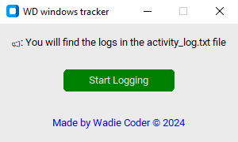

# WD Windows Tracker

**WD Windows Tracker (beta)** is a simple application designed to record user actions on your Windows laptop. Whether you're stepping away for a moment or leaving your device unattended, this application helps you monitor any activities that occur in your absence.

## UI Screenshot

<p align="center">
  
</p>


## Why Use WD Windows Tracker?

I created this application because it is *mon besoin* (my need), and I couldn't find an app that did exactly what I wanted. By making it open source, I hope it can be enhanced by the community and become even more powerful and user-friendly. If you ever leave your laptop and worry that someone might touch it or access your files, WD Windows Tracker is the perfect solution for you. It captures all keyboard and mouse activities, providing a log of actions that you can review later. This is particularly useful for maintaining your privacy and security.

## Features

- Records keyboard presses and mouse movements.
- Generates a log of activities with timestamps.
- Easy-to-use interface built with Tkinter.

## Installation

You have two options for running the application:

### Option 1: Run the Script Directly

1. **Clone or Download the Repository**: Get the source code from the index.py file.
2. **Install Required Packages**: Make sure you have `pynput` and `tkinter` installed. You can install `pynput` using pip:
   ```bash
   pip install pynput
   pip install customtkinter
   ```
3. **Run the Script**: Navigate to the directory containing the script and run it:
   ```bash
   python activity_logger_with_gui.py
   ```
## Future Improvements

This is the first version of WD Windows Tracker, and we plan to add more features in future updates to enhance functionality and user experience.

## Made with Love By wadie coder

This application was created with passion and care by [wadiecoder.com](https://www.wadiecoder.com).

##contact me via gmail
wadie@wadiecoder.com

## Follow me on Instagram:
https://www.instagram.com/wadie.coder/
